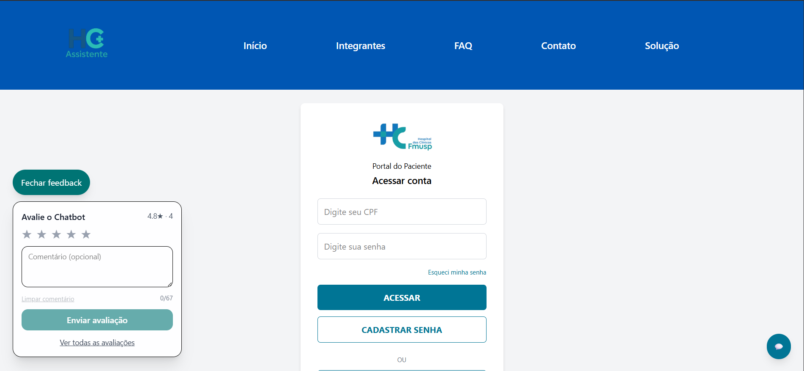
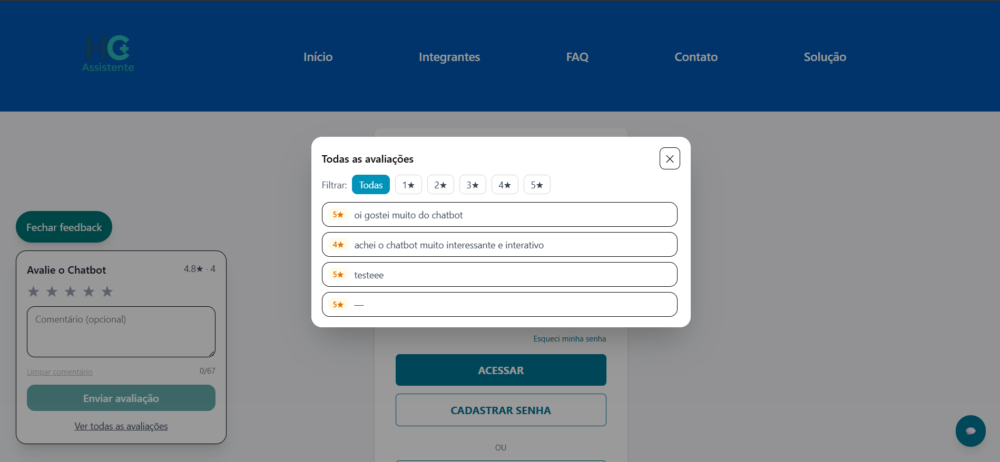

# 📌 HC Assistente  

Nosso projeto tem como objetivo **reduzir a taxa de absenteísmo das teleconsultas** por meio de uma solução digital que facilita a comunicação com os pacientes, oferecendo suporte e tirando dúvidas em tempo real.  

---

## 📂 Estrutura do Projeto ( Atualizada )
A estrutura principal do projeto está organizada da seguinte forma:  

```
src
┣ assets
┣ ┣ icons
┣ ┣ img
┣ ┣ logos
┣ components/
┣ ┣ Chathc.tsx
┣ ┣ Footer.tsx
┣ ┣ Header.tsx
┣ ┣ MemberCard.tsx
┣ ┣ MemberModal.tsx
┣ ┣ RatingWidget.tsx
┣ pages/
┃ ┣ Contact.tsx
┃ ┣ Faq.tsx
┃ ┣ Home.tsx
┃ ┣ Members.tsx
┃ ┗ Solution.tsx
┣ services/
┣ ┣ avaliacoes.ts
┣ types/
┣ ┣ member.ts
┣ App.tsx
┣ index.css
┣ main.tsx
┗ vite-env.d.ts
```


---

## 🛠️ Tecnologias Utilizadas  

- React  
- Vite  
- TypeScript  
- TailwindCSS  
- Consumo de Api do Java

---

## 👨‍💻 Integrantes  

- Lucas da Silva Lima — RM: **562118**  
- Guilherme Barreto Ramos — RM: **561226**  
- Regis Santos de Macedo Junior — RM: **565699**  

---

# 🚀 Imagem com caixa para avaliar



# 🚀 Imagem com modal avaliações



## 🚀 Ícones 

- Mensagem de agradecimento - ✨
- Avaliação do chatbot - ★★★★★

## 🚀 Repositório  
git clone https://github.com/Challenge2025/sprint4.git
video explicativo do youtube